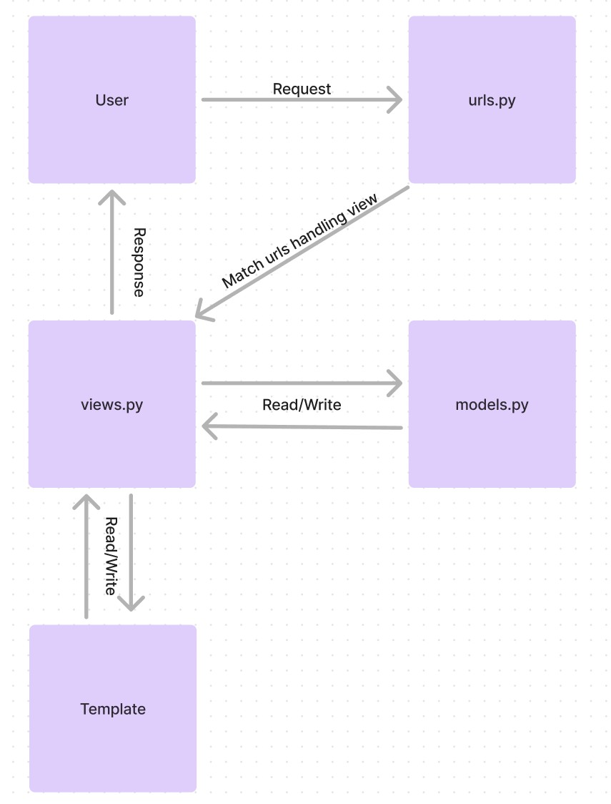
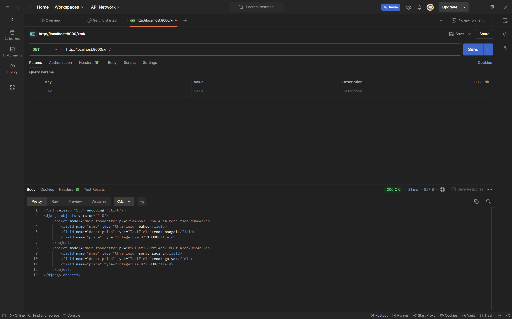
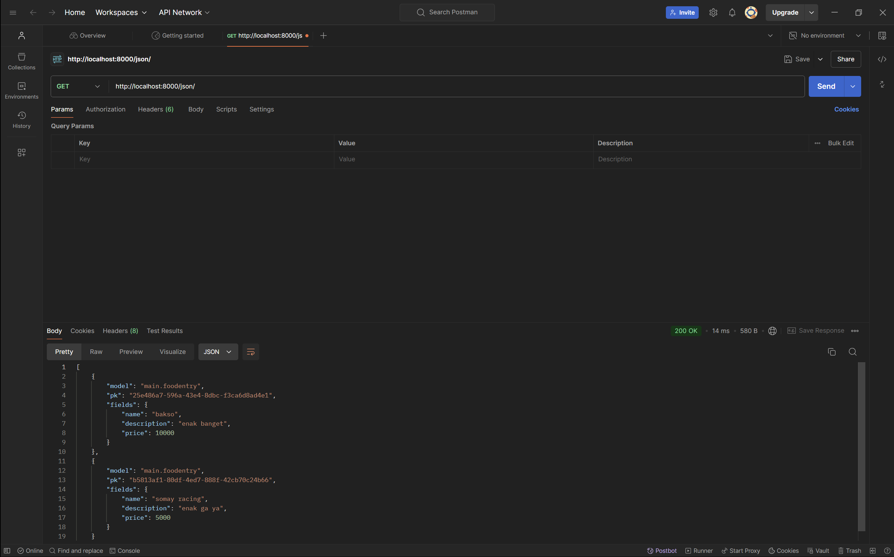
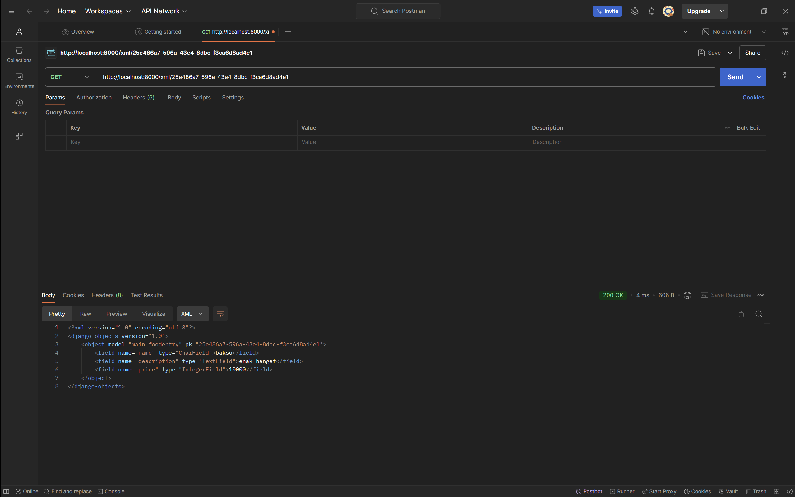
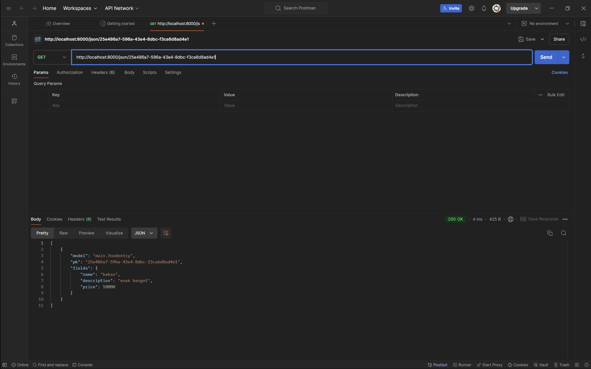

## Assignment 2

## Explain how you implemented the checklist above step-by-step (not just following the tutorial).
- Make sure Python and Django is already installed
- Create a new directory with the name RORONOA and enter it.
- Inside the directory, open the vscode terminal.
- Create a virtual environment by running the following command.
    ```
    python -m venv env
   ```
- Activate the virtual environment with the following command.
    ```
    env\Scripts\activate
    ```
- Create a requirements.txt file and add some dependencies.
    ```
    django
    gunicorn
    whitenoise
    psycopg2-binary
    requests
    urllib3
    ```
- Install the dependencies with the following command.
    ```
    pip install -r requirements.txt
    ```
- Create a Django project named skibishop with the following command:
    ```
    django-admin startproject skibishop .
    ```
- Include the following two strings in the ALLOWED_HOSTS list within settings.py for deployment purposes:
    ```
    ALLOWED_HOSTS = ["localhost", "127.0.0.1"]
    ```
- Run the Django server with the following command:
    ```
    python manage.py runserver
    ```
- Create a new application called main by running the following command:
    ```
    python manage.py startapp main
    ```
- Open the settings.py file inside the skibishop project directory. Add 'main' to the INSTALLED_APPS variable as shown below.
    ```
    INSTALLED_APPS = [
    ...,
    'main'
    ]
    ```
- Create a new directory named templates inside the main application directory.
- Inside the templates directory, create a new file named main.html and fill the main.html file with the following code
    ```
    <h1>SKIBI SHOP</h1>

    <h5>Name: </h5>
    <p>{{ name }}</p> <!-- Change according to your name -->
    <h5>Class: </h5>
    <p>{{ class }}</p> <!-- Change according to your class -->
    ```
- Open the models.py file in the main application directory.

    Fill the models.py file with the following code:
    from django.db import models
    ```
    class product(models.Model):
        name = models.CharField(max_length=255)
        mood_intensity = models.IntegerField()
        description = models.TextField()
    ```
- After creating the model, run migrations.
    ```
    python manage.py makemigrations
    python manage.py migrate
    ```
- Open the views.py file located in the main application file.
- Add the show_main function.
    ```
    from django.shortcuts import render

    def show_main(request):
    context = {
        'name': 'Anindiyo Banu',
        'class': 'PBP KKI'
    }

    return render(request, "main.html", context)
    ```
- Modify the main.html template to display data that has been retrieved from the model.
    ```
    <h1>SKIBI SHOP</h1>

    <h5>Name: </h5>
    <p>{{ name }}</p> <!-- Change according to your name -->
    <h5>Class: </h5>
    <p>{{ class }}</p> <!-- Change according to your class -->
    ```
- Configuring the URL Routing for the main application. Create a urls.py file in the main directory.

- Paste the following content inside urls.py:
    ```
    from django.urls import path
    from main.views import show_main

    app_name = 'main'

    urlpatterns = [
        path('', show_main, name='show_main'),
    ]
    ```
- Open the urls.py file inside of the skibishop project directory, import the include function.
    ```
    from django.urls import path, include
    ```
- Add the following URL route to direct to the main view within the urlpatterns variable
    ```
    urlpatterns = [
    ...
    path('', include('main.urls')),
    ...
    ]
    ```
- Perform deployment to PWS so that it can be accessed by others via the Internet

- Create a new project labeled as skibishop
- On the settings.py file of the Django project that you have just created, add the PWS deployment URL to the ALLOWED_HOSTS field.
    ```
    ALLOWED_HOSTS = ["localhost", "127.0.0.1", "anindiyo-banu-skibishop.pbp.cs.ui.ac.id"]
    ```
- Do a git add, commit, and push change to the GitHub repository you have created.

## Create a diagram that contains the request client to a Django-based web application and the response it gives, and explain the relationship between urls.py, views.py, models.py, and the html file


The user sends a request to the web server.
The request is routed through urls.py to the appropriate view in views.py.
The view may communicate with models.py to access or update data.
The view renders the data into an HTML template.
Finally, the response is sent back to the user.

## Explain the use of git in software development!
Git plays a critical role in software development by providing a powerful, distributed version control system that supports collaboration, branching, code reviews, and historical tracking of changes. It enables teams to work together efficiently, manage large projects, and maintain the integrity of the codebase throughout the development lifecycle.

## In your opinion, out of all the frameworks available, why is Django used as the starting point for learning software development?
Django is an excellent starting point for learning software development because it provides a balanced mix of simplicity, structure, and functionality. It allows to quickly build full-stack web applications, teaches them best practices, and offers a supportive community. Additionally, as a Python-based framework, it makes transitioning to more complex development tasks smooth, ensuring that developers have both a strong foundation and room to grow their skills.

## Why is the Django model called an ORM?
Django's model is called an ORM because it allows developers to work with relational databases using object-oriented programming techniques, hiding the complexities of SQL behind an easy-to-use Python API. This not only speeds up development but also makes database operations more secure, maintainable, and scalable. Django’s ORM abstracts the database layer so that developers can focus on writing business logic without worrying about the specifics of SQL syntax or database management.

## Assignment 3

## Explain why we need data delivery in implementing a platform.
Data delivery ensures that information moves smoothly and securely between parts of a platform. It helps everything work together, provides fast responses, handles more users without slowing down, keeps data safe, and makes the platform easy to use.

## In your opinion, which is better, XML or JSON? Why is JSON more popular than XML?
JSON is more popular than XML because it’s simpler, smaller, faster, and works better with modern web technologies like JavaScript. It’s easier to read, write, and process, making it a better fit for most applications today, while XML is more complex and suited for specialized tasks.

##  Explain the functional usage of is_valid() method in Django forms. Also explain why we need the method in forms.
The is_valid() method in Django forms checks if the submitted data is correct and follows the form's rules. If the data is valid, it returns True, allowing further actions like saving data. If not, it returns False, helping display error messages. It's important for ensuring data accuracy and preventing errors.

## Why do we need csrf_token when creating a form in Django? What could happen if we did not use csrf_token on a Django form? How could this be leveraged by an attacker?
The csrf_token in Django forms protects against CSRF attacks, where attackers trick users into submitting harmful requests. Without it, malicious users could exploit the form to perform actions like changing data or transferring money without the user's knowledge. The token ensures that form submissions are from your website and not from attackers.

## Explain how you implemented the checklist above step-by-step (not just following the tutorial).
- Create a directory templates in the main directory (root folder) and create a new HTML file named base.html. Create the base.html file with the following code:
```

<!DOCTYPE html>
<html lang="en">
  <head>
    <meta charset="UTF-8" />
    <meta name="viewport" content="width=device-width, initial-scale=1.0" />
     
  </head>

  <body>
     
  </body>
</html>
```
- Open the settings.py file in the project directory (skibishop) and find the line that contains the TEMPLATES variable. Adjust the code with the following code to make the base.html file detected as a template file
```
...
TEMPLATES = [
    {
        'BACKEND': 'django.template.backends.django.DjangoTemplates',
        'DIRS': [BASE_DIR / 'templates'], # Add this line
        'APP_DIRS': True,
        ...
    }
]
...
```

 - Create a new file in the main directory with the name forms.py so that it can receive Product datas.
 ```
 from django.forms import ModelForm
from main.models import FoodEntry

class FoodEntryForm(ModelForm):
    class Meta:
        model = FoodEntry
        fields = ["name", "price", "description",]
```
- Changing the Primary Key From Integer to UUID. Add these lines to the models.py file on the main/ subdirectory
```
from django.db import models
import uuid

class FoodEntry(models.Model):
    id = models.UUIDField(primary_key=True, default=uuid.uuid4, editable=False)
    name = models.CharField(max_length=255)
    description = models.TextField()
    price = models.IntegerField()
```

- Open the views.py file in the main directory and add from django.shortcuts import render, redirect. Create a new function to add a product.
```
def create_food_entry(request):
    form = FoodEntryForm(request.POST or None)

    if form.is_valid() and request.method == "POST":
        form.save()
        return redirect('main:show_main')

    context = {'form': form}
    return render(request, "create_food_entry.html", context)
```
- Change the show_main function to the following
```
def show_main(request):
    food_entries = FoodEntry.objects.all()

    context = {
        'name': 'Anindiyo Banu',
        'class': 'PBP KKI',
        'food_entries': food_entries
    }

    return render(request, "main.html", context)
```
- Open the views.py file in the main directory and add these imports.
```
from django.http import HttpResponse
from django.core import serializers
```
- Insert the following functions into views.py.
```
def show_xml(request):
data = Product.objects.all()
return HttpResponse(serializers.serialize("xml", data), content_type="application/xml")

def show_json(request):
    data = Product.objects.all()
    return HttpResponse(serializers.serialize("json", data), content_type="application/json")

def show_xml_by_id(request, id):
    data = Product.objects.filter(pk=id)
    return HttpResponse(serializers.serialize("xml", data), content_type="application/xml")

def show_json_by_id(request, id):
    data = Product.objects.filter(pk=id)
    return HttpResponse(serializers.serialize("json", data), content_type="application/json")
```

- Open urls.py and import the following:
from main.views import show_main, create_food_entry show_xml, show_json, show_xml_by_id, show_json_by_id

- Add the URL path to the urlpatterns variable in the urls.py file
```
urlpatterns = [
    path('', show_main, name='show_main'),
    path('create-food-entry', create_food_entry, name='create_food_entry'),
    path('xml/', show_xml, name='show_xml'),
    path('xml/<str:id>/', show_xml_by_id, name='show_xml_by_id'),
    path('json/<str:id>/', show_json_by_id, name='show_json_by_id'),
]
```

## Access the four URLs in point 2 using Postman, take screenshots of the results in Postman, and add them to README.md.

XML


JSON


XML by id


JSON by id



## ASSIGNMENT 4

 ## What is the difference between HttpResponseRedirect() and redirect()?
HttpResponseRedirect() is a basic way to redirect in Django, where you manually provide the full URL. On the other hand, redirect() is a shortcut that simplifies the process by allowing you to pass a view name, model, or URL, and Django automatically resolves it for you. redirect() is more convenient for most cases, while HttpResponseRedirect() gives more control if needed.

 ## Explain how the MoodEntry model is linked with User!
 The FoodEntry model is linked to the User model through a ForeignKey relationship, meaning each food entry is associated with a specific user who creates or owns it. The ForeignKey(User, on_delete=models.CASCADE) field connects the FoodEntry to a user, so every entry belongs to a single user from the User table. If the user is deleted, all associated food entries will also be removed (on_delete=models.CASCADE). This relationship ensures that each food entry can be tracked to the user who added it.
 
 ## What is the difference between authentication and authorization, and what happens when a user logs in? Explain how Django implements these two concepts.
Authentication is the process of verifying who a user is, while authorization is about determining what the user is allowed to do. In simple terms, authentication checks if a user is who they claim to be (like entering a username and password to log in), and authorization checks what permissions or access that user has once logged in (like whether they can view or edit certain pages).

When a user logs in, Django first performs authentication by checking the credentials (username and password) against the database. If the credentials are correct, Django creates a session for the user, which keeps them logged in.

After the user is authenticated, Django handles authorization by using permissions and groups. These determine what actions the user is allowed to perform, like accessing certain views or modifying data. Django's built-in User model and the auth system manage both authentication and authorization, making it easy to restrict or grant access to parts of your app based on the user's permissions.

 ## How does Django remember logged-in users? Explain other uses of cookies and whether all cookies are safe to use.
 Django remembers logged-in users by using session cookies, which store a unique session ID in the browser. Cookies can also be used for things like saving preferences or tracking activity. However, not all cookies are safe, some can be misused for tracking or be intercepted if not secured properly. Using secure connections and adding security flags helps protect cookies.

 ## Explain how did you implement the checklist step-by-step (apart from following the tutorial).
 - First, activate env in the terminal
 - Open views.py in the main subdirectory and add these imports:
    ```
    from django.contrib.auth.forms import UserCreationForm
    from django.contrib import messages
    ```
- Add the following register function to views.py
    ```
    def register(request):
        form = UserCreationForm()

        if request.method == "POST":
            form = UserCreationForm(request.POST)
            if form.is_valid():
                form.save()
                messages.success(request, 'Your account has been successfully created!')
                return redirect('main:login')
        context = {'form':form}
        return render(request, 'register.html', context)
    ```

- Create a new html file named register.html in the main/templates directory and add the following code
    ```
     
    <title>Register</title>
     

    <div class="login">
    <h1>Register</h1>

    <form method="POST">
        
        <table>
        {{ form.as_table }}
        <tr>
            <td></td>
            <td><input type="submit" name="submit" value="Register" /></td>
        </tr>
        </table>
    </form>

    
    <ul>
        
        <li>{{ message }}</li>
        
    </ul>
    
    </div>

    
    ```
- Open urls.py in the main subdirectory and import the register function., then add a URL path to urlpatterns to access the imported function.
    ```
    path('register/', register, name='register'),
    ```
-  Reopen views.py in the main subdirectory and add the imports authenticate, login and AuthenticationForm
    ```
    from django.contrib.auth.forms import UserCreationForm, AuthenticationForm
    from django.contrib.auth import authenticate, login
    ```
-  Add the login_user function below into views.py
    ```
    def login_user(request):
        if request.method == 'POST':
            form = AuthenticationForm(data=request.POST)

            if form.is_valid():
                    user = form.get_user()
                    login(request, user)
                    return redirect('main:show_main')

        else:
            form = AuthenticationForm(request)
        context = {'form': form}
        return render(request, 'login.html', context)
    ```

- Create a new HTML file named login.html in the main/templates directory. Fill it with the following template:
    ```
    

    
    <title>Login</title>
    

    
    <div class="login">
    <h1>Login</h1>

    <form method="POST" action="">
        
        <table>
        {{ form.as_table }}
        <tr>
            <td></td>
            <td><input class="btn login_btn" type="submit" value="Login" /></td>
        </tr>
        </table>
    </form>

    
    <ul>
        
        <li>{{ message }}</li>
        
    </ul>
     Don't have an account yet?
    <a href="">Register Now</a>
    </div>

    

- Open urls.py in the main subdirectory and import the function you just created and add the URL path to urlpatterns to access the function.
    ```
    from main.views import login_user


    urlpatterns = [
   ...
   path('login/', login_user, name='login'),
    ]
    ```
- Reopen views.py in the main subdirectory and add the following logout import at the top and add the following function to views.py
    ```
    from django.contrib.auth import logout

    def logout_user(request):
        logout(request)
        return redirect('main:login')

    ```

- Open main.html file in the main/templates directory and add the following code snippet 
    ```
    <a href="">
        <button>Logout</button>
    </a>
    ```

- Open urls.py in the main subdirectory and import the logout_user function, add the URL path to the url patterns
    ```
    from main.views import logout_user


    urlpatterns = [
        ...
        path('logout/', logout_user, name='logout'),
    ]
- Reopen views.py in the main subdirectory and add the login_required import
    ```
    from django.contrib.auth.decorators import login_required
    ```
- Add the following code snippet above the show_main function
    ```
    ...
    @login_required(login_url='/login')
    def show_main(request):
    ...
    ```
- Reopen views.py in the main subdirectory. Add the imports for HttpResponseRedirect, reverse, and datetime at the very top.
    ```
    import datetime
    from django.http import HttpResponseRedirect
    from django.urls import reverse
    ```
- Add the functionality to set a cookie named last_login to track when the user last logged in in the login_use function
    ```
    if form.is_valid():
        user = form.get_user()
        login(request, user)
        response = HttpResponseRedirect(reverse("main:show_main"))
        response.set_cookie('last_login', str(datetime.datetime.now()))
        return response
    ```

- In the show_main function, add the snippet 'last_login': request.COOKIES['last_login'] to the context variable
    ```
    context = {
        'name': 'Pak Bepe',
        'class': 'PBP D',
        'npm': '2306123456',
        'mood_entries': mood_entries,
        'last_login': request.COOKIES['last_login'],
    }
    ```
- Modify the logout_user function
    ```
    def logout_user(request):
        logout(request)
        response = HttpResponseRedirect(reverse('main:login'))
        response.delete_cookie('last_login')
        return response
    ```

- Open the main.html file and add the following snippet after the logout button to display the last login data.
    ```
    <h5>Last login session: {{ last_login }}</h5>
    ```

- Open models.py in the main subdirectory, add the following import and add the following code in the previously created FoodEntry model
    ```
    from django.contrib.auth.models import User

    class FoodEntry(models.Model):
        user = models.ForeignKey(User, on_delete=models.CASCADE)

    ```

- Reopen views.py in the main subdirectory and modify the code in the create_food_entry function

    ```
    def create_food_entry(request):
        form = FoodEntryForm(request.POST or None)

        if form.is_valid() and request.method == "POST":
            food_entry = form.save(commit=False)
            food_entry.user = request.user
            food_entry.save()
            return redirect('main:show_main')

        context = {'form': form}
        return render(request, "create_food_entry.html", context)
    ```

- Change the value of mood_entries and context in the function show_main
    ```
    def show_main(request):
        food_entries = FoodEntry.objects.filter(user=request.user)

        context = {
            'name': request.user.username,
            ...
        }
    ```
- Save all changes and run the model migration with python manage.py makemigrations. You should encounter an error during the model migration. Select 1. Then type 1 again to assign the user with ID 1.

- Run python manage.py migrate to apply the migration

- Add another import statement in settings.py in the mental_health_tracker subdirectory. Then, change the variable DEBUG in settings.py
    ```
    import os


    PRODUCTION = os.getenv("PRODUCTION", False)
    DEBUG = not PRODUCTION
    ```

- Run your Django project with the command 
    ```
    python manage.py runserver
    ```


## Assignment 5
##  If there are multiple CSS selectors for an HTML element, explain the priority order of these CSS selectors!
When multiple CSS selectors are applied to the same HTML element, CSS decides which style to apply using something called specificity. Here’s how CSS prioritizes selectors:
1. Inline Styles: These are styles written directly in the HTML element using the style attribute. Inline styles always win because they are the most specific.
2. IDs: If you target an element by its ID, that style has higher priority than a class or tag name. IDs are written with a # before the name.
3. Classes, Attributes, Pseudo-Classes: If you use a class (written with a dot .), an attribute selector (like [type="text"]), or a pseudo-class (like :hover), these styles are in the next priority level.
4. Tags/Elements: If you target an element by its tag (like h1, p, div), these styles have the lowest priority.

If two selectors have the same specificity, the one that appears later in the CSS file will be applied.

## Why does responsive design become an important concept in web application development? Give examples of applications that have and have not implemented responsive design!

Responsive design is important in web development because it ensures websites work well on all devices, from desktops to smartphones. As more users access the web via mobile, responsive design improves user experience, boosts engagement, and is cost-effective since it avoids creating separate mobile and desktop sites. It also helps with SEO, as search engines favor mobile-friendly sites.

Examples of Applications with Responsive Design:
- Twitter: Adjusts layout for different screens.
- YouTube: Resizes the video player and content.
- Amazon: Adapts navigation and product grids for mobile.

Examples of Applications without Responsive Design:
- Old Government Websites: Require zooming and scrolling on mobile.
- Legacy Business Websites: Fixed layouts don't adjust to smaller screens.

## Explain the differences between margin, border, and padding, and how to implement these three things!
1. Margin: The space outside the element's border, between the element and surrounding elements. It creates distance between elements.
2. Border: The line around the padding and content of an element. It defines the edge of the element.
3. Padding: The space inside the element, between the content and the border. It pushes the content inward.

Example: 
```
.example {
  margin: 20px;        /* Space outside the element */
  border: 2px solid black; /* Border around the element */
  padding: 10px;       /* Space inside the element */
}
```
## Explain the concepts of flex box and grid layout along with their uses!
Flexbox is a one-dimensional layout system, meaning it works either in a row or a column. It's great for aligning and distributing space between items in a container.

Main Concepts:
- Flex container: The parent element that contains the items.
- Flex items: The child elements that are laid out inside the flex container.

Common Properties:
- display: flex;: Turns an element into a flex container.
- justify-content: Aligns items horizontally (in a row).
- align-items: Aligns items vertically (in a column).
- flex-direction: Specifies the direction (row or column).

Use Cases:
- When you need to align items in a single row or column (like buttons in a navigation bar).
- Responsive layouts where items adjust and fill available space.

## Explain how you implemented the checklist above step-by-step (not just following the tutorial)!
1. Adding Tailwind to the Application

    Open base.html and add the Tailwind cdn script in the head section
    ```
    <head>
    
        <meta charset="UTF-8" />
        <meta name="viewport" content="width=device-width, initial-scale=1">
    
    <script src="https://cdn.tailwindcss.com">
    </script>
    </head>
    ```

2. Creating a Delete and Edit Feature

    - Open views.py in the main subdirectory
    - Create a new function for edit_food
        ```
        def edit_food(request, id):
            food = FoodEntry.objects.get(pk = id)

            # Set food entry as an instance of the form
            form = FoodEntryForm(request.POST or None, instance=food)

            if form.is_valid() and request.method == "POST":
                # Save form and return to home page
                form.save()
                return HttpResponseRedirect(reverse('main:show_main'))

            context = {'form': form}
            return render(request, "edit_food.html", context)
        ```
    - Create a new function for delete_food
        ```
        def delete_food(request, id):
            # Get food based on id
            food = FoodEntry.objects.get(pk = id)
            # Delete food
            food.delete()
            # Return to home page
            return HttpResponseRedirect(reverse('main:show_main'))
        ```

    - Create a new HTML file named edit_food.html and fill the file with the following code
        ```
        

        

        

        <h1>Edit Mood</h1>

        <form method="POST">
            
            <table>
                {{ form.as_table }}
                <tr>
                    <td></td>
                    <td>
                        <input type="submit" value="Edit Mood"/>
                    </td>
                </tr>
            </table>
        </form>

        
        ```
    - Open urls.py in the main folder and import the functions created
        ```
        from main.views import delete_food
        from main.views import edit_food

        ```

    - Add a url path to URLPATTERNS to access the imported functions
        ```
        urlpatterns = [
            ...
            path('edit-food/<uuid:id>', edit_food, name='edit_food'),        
            path('delete/<uuid:id>', delete_food, name='delete_food'),
         ]   
        ```
    - Open the main.html file in the main/templates folder and modify the existing code to be like this so that there's a delete button for each product.
        ```
            ...
            <tr>
                ...
                <td>
                    <a href="">
                        <button>
                            Edit
                        </button>
                    </a>
                </td>
                <td>
                    <a href="">
                        <button>
                            Delete
                        </button>
                    </a>
                </td>
            </tr>
            ...
        ```

3. Adding a Navigation Bar to the Application

    - Create a new HTML file named navbar.html in the templates/ folder in the root directory. Fill the navbar.html with the following code
        ```
        <nav class="bg-zinc-800 shadow-lg fixed top-0 left-0 z-40 w-screen">
        <div class="max-w-7xl mx-auto px-4 sm:px-6 lg:px-8">
            <div class="flex items-center justify-between h-16">
            <div class="flex items-center">
                <h1 class="text-2xl font-bold text-center text-white">SKIBISHOP</h1>
            </div>
            <div class="hidden md:flex items-center">
                
                <span class="text-gray-300 mr-4">Welcome, {{ user.username }}</span>
                <a href="" class="text-center bg-red-500 hover:bg-red-600 text-white font-bold py-2 px-4 rounded transition duration-300">
                    Logout
                </a>
                
                <a href="" class="text-center bg-blue-500 hover:bg-blue-600 text-white font-bold py-2 px-4 rounded transition duration-300 mr-2">
                    Login
                </a>
                <a href="" class="text-center bg-green-500 hover:bg-green-600 text-white font-bold py-2 px-4 rounded transition duration-300">
                    Register
                </a>
                
            </div>
            <div class="md:hidden flex items-center">
                <button class="mobile-menu-button">
                <svg class="w-6 h-6 text-white" fill="none" stroke-linecap="round" stroke-linejoin="round" stroke-width="2" viewBox="0 0 24 24" stroke="currentColor">
                    <path d="M4 6h16M4 12h16M4 18h16"></path>
                </svg>
                </button>
            </div>
            </div>
        </div>
        <!-- Mobile menu -->
        <div class="mobile-menu hidden md:hidden  px-4 w-full md:max-w-full">
            <div class="pt-2 pb-3 space-y-1 mx-auto">
            
                <span class="block text-gray-300 px-3 py-2">Welcome, {{ user.username }}</span>
                <a href="" class="block text-center bg-red-500 hover:bg-red-600 text-white font-bold py-2 px-4 rounded transition duration-300">
                Logout
                </a>
            
                <a href="" class="block text-center bg-blue-500 hover:bg-blue-600 text-white font-bold py-2 px-4 rounded transition duration-300 mb-2">
                Login
                </a>
                <a href="" class="block text-center bg-green-500 hover:bg-green-600 text-white font-bold py-2 px-4 rounded transition duration-300">
                Register
                </a>
            
            </div>
        </div>
        <script>
            const btn = document.querySelector("button.mobile-menu-button");
            const menu = document.querySelector(".mobile-menu");
        
            btn.addEventListener("click", () => {
            menu.classList.toggle("hidden");
            });
        </script>
        </nav>
        ```

4. Configuring Static Files in the Application

    - Adding the WhiteNoise middleware to settings.py
        ```
        ...
        MIDDLEWARE = [
            'django.middleware.security.SecurityMiddleware',
            'whitenoise.middleware.WhiteNoiseMiddleware', # Add it directly under SecurityMiddleware
            ...
        ]
        ...
        ```
    - Make sure that the STATIC_ROOT, STATICFILES_DIRS, and STATIC_URL variables are configured like this
        ```
        ...
        STATIC_URL = '/static/'
        if DEBUG:
            STATICFILES_DIRS = [
                BASE_DIR / 'static' # refers to /static root project in development mode
            ]
        else:
            STATIC_ROOT = BASE_DIR / 'static' # refers to /static root project in production mode
        ...
        ```
5. Adding Styles to the Application with Tailwind and External CSS

    -  Create a new folder named static in the root folder. Inside the static folder, create a folder named global.css
    - Link global.css and Tailwind script to base.html. Modify your base.html file as follows:
        ```
        
        <!DOCTYPE html>
        <html lang="en">
        <head>
            <meta charset="UTF-8" />
            <meta name="viewport" content="width=device-width, initial-scale=1.0" />
             
            <script src="https://cdn.tailwindcss.com"></script>
            <link rel="stylesheet" href=""/>
        </head>
        <body>
             
        </body>
        </html>
        ``
    - Modify the global.css file in static/css/global.css as follows:
        ```
        .form-style form input, form textarea, form select {
            width: 100%;
            padding: 0.5rem;
            border: 2px solid #bcbcbc;
            border-radius: 0.375rem;
        }
        .form-style form input:focus, form textarea:focus, form select:focus {
            outline: none;
            border-color: #674ea7;
            box-shadow: 0 0 0 3px #674ea7;
        }
        @keyframes shine {
            0% { background-position: -200% 0; }
            100% { background-position: 200% 0; }
        }
        .animate-shine {
            background: linear-gradient(120deg, rgba(255, 255, 255, 0.3), rgba(255, 255, 255, 0.1) 50%, rgba(255, 255, 255, 0.3));
            background-size: 200% 100%;
            animation: shine 3s infinite;
        }
        ```
    - Styling the Login Page

        - Change the login.html file in the main/templates/ subdirectory to be as follows:
            ```
            

            
            <title>Login</title>
            

            
            <div class="min-h-screen flex items-center justify-center w-screen bg-gray-100 py-12 px-4 sm:px-6 lg:px-8">
            <div class="max-w-md w-full space-y-8">
                <div>
                <h2 class="mt-6 text-center text-black text-3xl font-extrabold text-gray-900">
                    Login to your account
                </h2>
                </div>
                <form class="mt-8 space-y-6" method="POST" action="">
                
                <input type="hidden" name="remember" value="true">
                <div class="rounded-md shadow-sm -space-y-px">
                    <div>
                    <label for="username" class="sr-only">Username</label>
                    <input id="username" name="username" type="text" required class="appearance-none rounded-none relative block w-full px-3 py-2 border border-gray-300 placeholder-gray-500 text-gray-900 rounded-t-md focus:outline-none focus:ring-indigo-500 focus:border-indigo-500 focus:z-10 sm:text-sm" placeholder="Username">
                    </div>
                    <div>
                    <label for="password" class="sr-only">Password</label>
                    <input id="password" name="password" type="password" required class="appearance-none rounded-none relative block w-full px-3 py-2 border border-gray-300 placeholder-gray-500 text-gray-900 rounded-b-md focus:outline-none focus:ring-indigo-500 focus:border-indigo-500 focus:z-10 sm:text-sm" placeholder="Password">
                    </div>
                </div>

                <div>
                    <button type="submit" class="group relative w-full flex justify-center py-2 px-4 border border-transparent text-sm font-medium rounded-md text-white bg-slate-800 hover:bg-slate-600 focus:outline-none focus:ring-2 focus:ring-offset-2 focus:ring-indigo-500">
                    Sign in
                    </button>
                </div>
                </form>

                
                <div class="mt-4">
                
                
                        <div class="bg-green-100 border border-green-400 text-green-700 px-4 py-3 rounded relative" role="alert">
                            <span class="block sm:inline">{{ message }}</span>
                        </div>
                    
                        <div class="bg-red-100 border border-red-400 text-red-700 px-4 py-3 rounded relative" role="alert">
                            <span class="block sm:inline">{{ message }}</span>
                        </div>
                    
                        <div class="bg-blue-100 border border-blue-400 text-blue-700 px-4 py-3 rounded relative" role="alert">
                            <span class="block sm:inline">{{ message }}</span>
                        </div>
                    
                
                </div>
                

                <div class="text-center mt-4">
                <p class="text-sm text-black">
                    Don't have an account yet?
                    <a href="" class="font-medium text-slate-600 hover:text-indigo-300">
                    Register Now
                    </a>
                </p>
                </div>
            </div>
            </div>
            

            ```
    - Styling the Register Page
        - Modify the register.html file in the main/templates/ subdirectory as follows:
            ```
            

            
            <title>Register</title>
            

            
            <div class="min-h-screen flex items-center justify-center bg-gray-100 py-12 px-4 sm:px-6 lg:px-8">
            <div class="max-w-md w-full space-y-8 form-style">
                <div>
                <h2 class="mt-6 text-center text-3xl font-extrabold text-black">
                    Create your account
                </h2>
                </div>
                <form class="mt-8 space-y-6" method="POST">
                
                <input type="hidden" name="remember" value="true">
                <div class="rounded-md shadow-sm -space-y-px">
                    
                    <div class="mt-4">
                        <label for="{{ field.id_for_label }}" class="mb-2 font-semibold text-black">
                        {{ field.label }}
                        </label>
                        <div class="relative">
                        {{ field }}
                        <div class="absolute inset-y-0 right-0 pr-3 flex items-center pointer-events-none">
                            
                            <svg class="h-5 w-5 text-red-500" fill="currentColor" viewBox="0 0 20 20">
                                <path fill-rule="evenodd" d="M18 10a8 8 0 11-16 0 8 8 0 0116 0zm-7 4a1 1 0 11-2 0 1 1 0 012 0zm-1-9a1 1 0 00-1 1v4a1 1 0 102 0V6a1 1 0 00-1-1z" clip-rule="evenodd" />
                            </svg>
                            
                        </div>
                        </div>
                        
                        
                            <p class="mt-1 text-sm text-red-600">{{ error }}</p>
                        
                        
                    </div>
                    
                </div>

                <div>
                    <button type="submit" class="group relative w-full flex justify-center py-2 px-4 border border-transparent text-sm font-medium rounded-md text-white bg-slate-800 hover:bg-slate-600 focus:outline-none focus:ring-2 focus:ring-offset-2 focus:ring-indigo-500">
                    Register
                    </button>
                </div>
                </form>

                
                <div class="mt-4">
                
                <div class="bg-red-100 border border-red-400 text-red-700 px-4 py-3 rounded relative" role="alert">
                    <span class="block sm:inline">{{ message }}</span>
                </div>
                
                </div>
                

                <div class="text-center mt-4">
                <p class="text-sm text-black">
                    Already have an account?
                    <a href="" class="font-medium text-slate-600 hover:text-indigo-300">
                    Login here
                    </a>
                </p>
                </div>
            </div>
            </div>
            
            ```
    - Styling the Home Page
        - Create a card_info.html file in the main/templates directory, then add the following HTML code:
            ```
            <div class="bg-slate-900 rounded-xl overflow-hidden border-2 border-slate-950">
            <div class="p-4 animate-shine">
                <h5 class="text-lg font-semibold text-gray-200">{{ title }}</h5>
                <p class="text-white">{{ value }}</p>
            </div>
            </div>
            ```
        - Create a card_food.html file in the main/templates directory, then add the following HTML code:
            ```
            

            <div class="relative break-inside-avoid">
            <div class="absolute top-0 left-0 z-50"> 
            </div>
            
            <div class="absolute top-2 z-10 left-1/2 -translate-x-1/2 flex items-center -space-x-2">
                <div class="w-[3rem] h-8 bg-neutral-300 rounded-md opacity-80 -rotate-90"></div>
                <div class="w-[3rem] h-8 bg-neutral-300 rounded-md opacity-80 -rotate-90"></div>
            </div>
            <div class="relative top-5 bg-stone-400 shadow-md rounded-lg mb-6 break-inside-avoid flex flex-col border-2 border-gray-800 transform rotate-1 hover:rotate-0 transition-transform duration-300">
                <div class="bg-stone-400 text-gray-800 p-4 rounded-t-lg border-b-2 border-gray-800">
                <h3 class="font-bold text-xl mb-2" style="font-family: 'Fredoka', sans-serif;">{{ food_entry.name }}</h3>
                <p class="font-semibold text-lg mb-2" style="font-family: 'Fredoka', sans-serif;">Food Description</p>
                <p class="text-gray-700 mb-2" style="font-family: 'Fredoka', sans-serif;">{{ food_entry.description }}</p>
                
                </div>
                <div class="p-4">
                <p class="text-gray-600" style="font-family: 'Fredoka', sans-serif;">Rp {{ food_entry.price }}</p>
                
                </div>
            </div>
            <div class="absolute top-0 -right-4 flex space-x-1">
                <a href="" class="bg-yellow-500 hover:bg-yellow-600 text-white rounded-full p-2 transition duration-300 shadow-md">
                <svg xmlns="http://www.w3.org/2000/svg" class="h-9 w-9" viewBox="0 0 20 20" fill="currentColor">
                    <path d="M13.586 3.586a2 2 0 112.828 2.828l-.793.793-2.828-2.828.793-.793zM11.379 5.793L3 14.172V17h2.828l8.38-8.379-2.83-2.828z" />
                </svg>
                </a>
                <a href="" class="bg-red-500 hover:bg-red-600 text-white rounded-full p-2 transition duration-300 shadow-md">
                <svg xmlns="http://www.w3.org/2000/svg" class="h-9 w-9" viewBox="0 0 20 20" fill="currentColor">
                    <path fill-rule="evenodd" d="M9 2a1 1 0 00-.894.553L7.382 4H4a1 1 0 000 2v10a2 2 0 002 2h8a2 2 0 002-2V6a1 1 0 100-2h-3.382l-.724-1.447A1 1 0 0011 2H9zM7 8a1 1 0 012 0v6a1 1 0 11-2 0V8zm5-1a1 1 0 00-1 1v6a1 1 0 102 0V8a1 1 0 00-1-1z" clip-rule="evenodd" />
                </svg>
                </a>
            </div>
            </div>
            ```

    - We need to display if the food_entry is still empty. Choose a sad photo or icon and name it very-sad2.png. Add the very-sad2.png photo to the static/image directory in the project root.
        - In the main/templates directory, modify main.html like this:
            ```
            
            

            
            <title>SKIBISHOP</title>
            
            
            
            <div class="overflow-x-hidden px-4 md:px-8 pb-8 pt-24 min-h-screen bg-pink-100 flex flex-col"
                style="background-image: url(''); background-size: cover; background-position: center; background-repeat: no-repeat;">
            

            

            <div class="p-2 mb-6 relative">
                <div class="relative grid grid-cols-1 z-30 md:grid-cols-3 gap-8">
                
                
                </div>
            </div>
                <div class="px-3 mb-4">
                <div class="flex rounded-md items-center bg-slate-800 py-2 px-4 w-fit">
                    <h1 class="text-white text-center">Last Login: {{last_login}}</h1>
                </div>
                </div>
                <div class="flex justify-end mb-6">
                    <a href="" class="bg-slate-800 hover:bg-slate-600 text-white font-bold py-2 px-4 rounded-lg transition duration-300 ease-in-out transform hover:-translate-y-1 hover:scale-105">
                        Add New Food Entry
                    </a>
                </div>
                
                
                <div class="flex flex-col items-center justify-center min-h-[24rem] p-6">
                    
                    <p class="text-center text-slate-50 mt-4">There is no food data in SKIBISHOP.</p>
                </div>
                
                <div class="columns-1 sm:columns-2 lg:columns-3 gap-6 space-y-6 w-full">
                    
                        
                    
                </div>
                
            </div>
            
            ```
    - Styling the Create Food Entry Page
        - Modify the create_food_entry.html file in the main/templates subdirectory as follows:
            ```
            
            
            
            <title>Create Food</title>
            

            
            

            <div class="overflow-x-hidden px-4 md:px-8 pb-8 pt-24 min-h-screen bg-pink-100 flex flex-col"
            style="background-image: url(''); background-size: cover; background-position: center; background-repeat: no-repeat;">
            <div class="container mx-auto px-4 py-8 mt-16 max-w-xl">
                <h1 class="text-3xl font-bold text-center mb-8 text-white">Create Food Entry</h1>
            
                <div class="bg-white shadow-md rounded-lg p-6 form-style">
                <form method="POST" class="space-y-6">
                    
                    
                    <div class="flex flex-col">
                        <label for="{{ field.id_for_label }}" class="mb-2 font-semibold text-gray-700">
                        {{ field.label }}
                        </label>
                        <div class="w-full">
                        {{ field }}
                        </div>
                        
                        <p class="mt-1 text-sm text-gray-500">{{ field.help_text }}</p>
                        
                        
                        <p class="mt-1 text-sm text-red-600">{{ error }}</p>
                        
                    </div>
                    
                    <div class="flex justify-center mt-6">
                    <button type="submit" class="bg-slate-800 text-white font-semibold px-6 py-3 rounded-lg hover:bg-slate-600 transition duration-300 ease-in-out w-full">
                        Create Food Entry
                    </button>
                    </div>
                </form>
                </div>
            </div>
            </div>

            
            ```

    - Styling the Edit Food Page
        - Modify the edit_food.html file in the main/templates subdirectory as follows:
            ```
            
            
            
            <title>Edit Food</title>
            

            
            
            <div class="overflow-x-hidden px-4 md:px-8 pb-8 pt-24 min-h-screen bg-pink-100 flex flex-col"
            style="background-image: url(''); background-size: cover; background-position: center; background-repeat: no-repeat;">
            <div class="container mx-auto px-4 py-8 mt-16 max-w-xl">
                <h1 class="text-3xl font-bold text-center mb-8 text-black">Edit Food Entry</h1>
            
                <div class="bg-white rounded-lg p-6 form-style">
                <form method="POST" class="space-y-6">
                    
                    
                        <div class="flex flex-col">
                            <label for="{{ field.id_for_label }}" class="mb-2 font-semibold text-gray-700">
                                {{ field.label }}
                            </label>
                            <div class="w-full">
                                {{ field }}
                            </div>
                            
                                <p class="mt-1 text-sm text-gray-500">{{ field.help_text }}</p>
                            
                            
                                <p class="mt-1 text-sm text-red-600">{{ error }}</p>
                            
                        </div>
                    
                    <div class="flex justify-center mt-6">
                        <button type="submit" class="bg-slate-800 text-white font-semibold px-6 py-3 rounded-lg hover:bg-slate-600 transition duration-300 ease-in-out w-full">
                            Edit Food Entry
                        </button>
                    </div>
                </form>
            </div>
            </div>
            </div>
            
            ```
